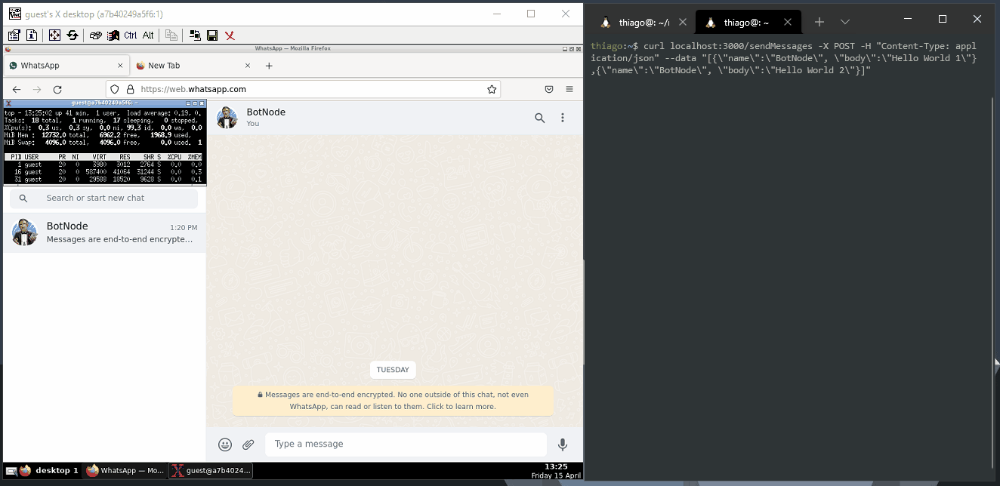

# proxy-node-docker-whatsapp
This unique application allows users to mimic a bot by responding to messages with ChatGPT when mentioned in a group chat. It also supports sending photos upon request.

The application's core technologies include Node.js, Playwright, and Redis. I chose Redis because it allows me to adjust application parameters without the need for deployments. Additionally, I can conveniently modify parameters via a web interface.

Important Note: During the initial setup, it's imperative to establish a VNC connection with the Docker container on port 5901 and sign in to WhatsApp Web. This is a one-time requirement, necessary when the container encounters errors or when the session expires.

## Tooling
- TightVNC Server
- NodeJS 18
- Playwright
- Openbox
- Xterm
- Tint2
- Redis

## See in Action


## How to run it?

```bash
git clone https://github.com/thiagosanches/proxy-node-docker-whatsapp.git
cd proxy-node-docker-whatsapp
docker-compose up --detach
```

## How to login?
```bash
curl localhost:3000/login
```
And scan the qr-code!

## How it works?

For the time being, the application operates exclusively within group chats. This restriction is in place to prevent potential issues with private messages, which can take various conversational paths. Group chats offer a more controlled 'environment.' In these groups, the application actively responds to any mentions your user receives, using suggestions from ChatGPT.

## What if I don't have a redis instance?

Setting up a Redis instance is straightforward; you can use Docker to do it:

```bash
docker run -v /local-data/:/data redis/redis-stack:latest 
```

If you choose to use Redis, remember to update the `REDIS_URL` in the [docker-compose.yaml](./docker-compose.yaml) file based on the Docker command you used. Ensure that you expose the ports correctly.

More information [here](https://hub.docker.com/r/redis/redis-stack).

However, if you don't want to use redis, you can replace the logic on the [`redis.js`](./redis.js) file to get the parameters from a config file or even from some environment variables. I'll explain the parameters in the table below.

| Key  | Description   |
|---|---|
|whatsapp/openai-bot-key|The OpenAPI Key.|
|whatsapp/openai-bot-chat-prompt|In the prompt where you instruct ChatGPT to mimic you, you can be as descriptive as you like. Please ensure you leave the placeholder (##TEXT##) intact. This allows the application to inject the message it receives from WhatsApp Web, providing context.|
|whatsapp/openai-bot-dalle-prompt|This will serve as the prompt used by DALL·E to generate images. Feel free to be as descriptive as you like. For added variation, you can include the ##TEXT## placeholder at the end of the phrase. This helps DALL·E generate photos based on the described activities.|
|whatsapp/openai-bot-temperature|ChatGPT temperature.|
|whatsapp/openai-bot-activities|This is utilized in the DALL·E prompt to introduce variety in image generation. It should consist of an array containing different values such as 'diving,' 'skiing,' 'running,' or any other activities you prefer.|
|whatsapp/openai-bot-turned-on|Sometimes you may want to disable your bot. You can do so by setting this parameter to 'true' or 'false'.|
|whatsapp/openai-bot-total-photos-limit|This sets a strict limit on the number of photos that the bot can 'take,' based on the configured amount.|
|whatsapp/openai-bot-max-tokens|The maximum tokens used in a chat conversation (createCompletion endpoint).|
|whatsapp/openai-bot-model|The ChatGPT model, which is used for the bot chat interactions.|
|whatsapp/openai-bot-name|Basically, it's your first name, which is used when someone mentions you in the group chat.|
|whatsapp/openai-bot-command-photo| This is a bit trickier. You, as a programmer, will understand it if someone asks for a photo. To use it, simply indicate in your chat prompt, 'If someone asks for a photo, only reply with photo:true.' The photo:true command instructs the bot to respond with that string, sometimes it works, but occasionally, it responds with a random message ending in 'photo:true.' The code includes a verification process for this.|
|whatsapp/openai-bot-command-photo-failed|This is used when the photo limit is reached, allowing us to respond with: 'No more photos for today.'. You can put anything you want.|


## Next Steps

- To achieve greater control when replying to messages, tracking message senders, and more, it's advisable to leverage a robust project that serves as a wrapper for WhatsApp, providing an experience close to an official API. A strong contender for this purpose is the following project: [WhatsApp Web.js](https://github.com/pedroslopez/whatsapp-web.js).
- If we're not using the project mentioned above, an alternative approach is to save the browser session and storage to disk. This way, we can avoid the need to log in to WhatsApp Web every time the container is recreated.
